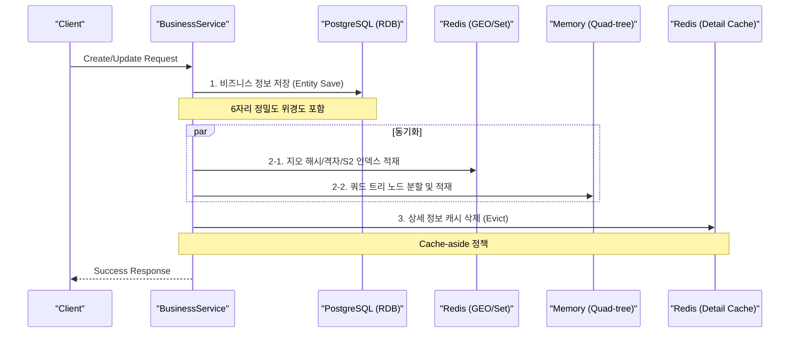
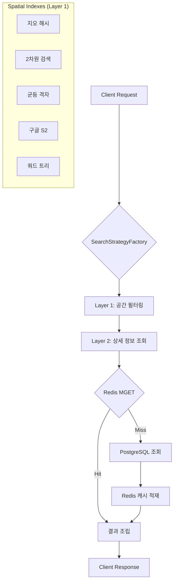

# 🧠 Proximity Service: 고도화된 공간 인덱싱 기술 심층 분석

본 문서는 서비스에 구현된 5가지 공간 인덱싱 전략의 아키텍처, 알고리즘 동작 원리, 그리고 기술적 트레이드오프를 엔지니어링 관점에서 상세히 기술합니다.

---

## 🛰️ 1. 지오 해시 (Geohash) - Redis GEO 기반

가장 널리 사용되는 방식으로, 위경도 좌표를 1차원 문자열 또는 정수로 매핑하는 방식입니다.

### 동작 원리
- **Recursive Partitioning**: 지구를 격자로 나누고, 각 격자를 다시 4개로 반복 시분할하여 고유한 비트 문자열을 생성합니다.
- **ZSET 활용**: Redis 내부적으로 위경도를 52비트 Geohash로 변환하여 `Sorted Set (ZSET)`의 `score`로 저장합니다.
- **Locality**: Geohash 값이 비슷하면 지리적으로도 가까울 확률이 높습니다 (단, 경계면 문제는 인접 8개 격자 탐색으로 해결).

### 구현 상세
- **`RedisGeoStrategy`**: Spring Data Redis의 `GEOSEARCH` 명령어를 사용하여 Skip-list 기반의 $O(\log N + M)$ 탐색을 수행합니다.

---

## 🏛️ 2. 2차원 검색 (SQL BBox)

관계형 데이터베이스의 인덱싱 기능을 활용한 가장 직관적인 방식입니다.

### 동작 원리
- **Bounding Box**: 검색 중심점으로부터 반경만큼 떨어진 최소(Min) 및 최대(Max) 위경도 범위를 계산합니다.
- **Range Scan**: `LAT BETWEEN minLat AND maxLat AND LON BETWEEN minLon AND maxLon` 쿼리를 수행합니다.

### 특징
- **장점**: 구현이 단순하며, DB 인덱스(B-Tree)를 즉시 활용할 수 있습니다.
- **단점**: 위경도가 독립적인 인덱스로 관리될 경우 인덱스 병합(Index Merge) 비용이 발생하며, 대규모 데이터셋에서는 성능이 선형적으로 저하될 수 있습니다.

---

## 🛰️ 3. 균등 격자 (Uniform Grid)

공간을 고정된 크기의 격자로 나누어 관리하는 정적 인덱싱 방식입니다.

### 동작 원리
- **Grid Mapping**: 지도를 특정 크기(예: 500m)의 격자로 나누고, 각 비즈니스의 위치를 `Grid ID (x, y)`로 변환합니다.
- **Redis Set Storage**: 각 격자 ID를 키로 하여 해당 격자에 속한 비즈니스 ID들을 **Redis Set**에 저장합니다 (`grid:x:y`).

### 탐색 알고리즘
1. 검색 반경을 격자 단위로 환산합니다.
2. 중심 격자를 포함한 주변 격자들의 키를 생성합니다.
3. Redis `SUNION` 연산을 통해 인접 격자들의 데이터를 한 번에 조회합니다.

---

## 🌐 4. 구글 S2 (Google S2 Geometry)

지구를 구체(Sphere)로 보고 힐베르트 곡선(Hilbert Curve)을 이용하여 1차원 선상에 매핑하는 고전적인 방식입니다.

### 동작 원리
- **Hilbert Curve**: 공간을 채우는 곡선을 이용하여 2차원의 인접성을 1차원 키(Cell ID)에서도 최대한 보존합니다.
- **Cell Covering**: 검색 영역(Circle/Cap)을 덮는 가변 크기의 S2 Cell 목록을 계산합니다.

### 기술적 우위
- **Scalability**: 데이터 밀도에 따라 셀 크기를 유연하게 조절(Leveling)할 수 있어 전 지구적 서비스에 적합합니다.
- **Storage**: Cell ID를 접두어로 사용하여 데이터를 샤딩하거나 캐싱하기에 매우 유리합니다.

---

## 🌲 5. 쿼드 트리 (Quad-tree)

2차원 영역을 4개의 하위 영역으로 재귀적으로 분할하는 트리 기반 인덱싱입니다.

### 동작 원리
- **Recursive Decomposition**: 특정 노드에 데이터가 일정 수(`MAX_CAPACITY`)를 초과하면 해당 영역을 4개(NW, NE, SW, SE)의 자식 노드로 분할합니다.
- **In-memory Search**: 루트 노드부터 시작하여 검색 영역과 겹치는(Intersect) 노드들만 재취적으로 탐색하여 후보군을 추출합니다.

### 특징
- **장점**: 데이터가 밀집된 영역은 더 세밀하게, 희소한 영역은 듬성듬성하게 관리되는 동적 특성을 가집니다.
- **단점**: 현재 구현은 메모리 내 객체 구조로 관리되므로 서버 재시작 시 인덱스 재구축이 필요하며, 분산 환경에서의 공유가 까다롭습니다.

---

## 🌊 7. 데이터 흐름 상세 (Workflows)

서비스의 실질적인 데이터 처리 과정을 생성(Write)과 조회(Read) 관점에서 분석합니다.

### 7-1. 비즈니스 생성/수정 흐름 (Write Flow)

새로운 업체가 등록되거나 정보가 변경될 때, 데이터는 **강한 정합성(DB)**과 **고속 검색(인덱스)**을 위해 다음과 같이 처리됩니다.

1.  **영속성 저장**: PostgreSQL에 원본 데이터를 저장합니다.
2.  **다중 인덱싱**: 모든 공간 인덱스를 최신 좌표로 동시 업데이트합니다.
3.  **캐시 무효화**: 정보 변경 시 기존 캐시를 삭제하여 데이터 정합성을 유지합니다.

---

### 7-2. 주변 검색 흐름 (Read Flow)

사용자가 특정 위치에서 주변 업체를 검색할 때, 시스템은 **2단계 아키텍처**를 통해 응답합니다.

1.  **인덱스 필터링 (Layer 1)**: 반경 내에 포함된 **비즈니스 ID**와 **거리** 목록만 빠르게 추출합니다.
2.  **상세 캐시 조회 (Layer 2)**: Redis에서 업체 상세 정보를 `MGET`으로 한 번에 가져옵니다.
3.  **Lazy Loading (Fallback)**: 캐시 미스 시 DB에서 조회 후 캐시에 적재합니다.

---

## ⚖️ 8. 기술 전략별 비교 요약

| 전략 | 저장 및 인덱스 관리 | 탐색 속도 | 검색 정확도 | 확장성 |
| :--- | :--- | :--- | :--- | :--- |
| **지오 해시** | Redis Sorted Set (Geohash Score) | 매우 빠름 | 높음 (52비트) | 매우 우수 |
| **2차원 검색** | PostgreSQL 인덱스 (B-Tree) | 보통 | 매우 높음 | 제한적 |
| **균등 격자** | Redis Set (Grid ID별 분산) | 빠름 | 보통 (격자 크기) | 우수 |
| **구글 S2** | Redis Set (Hilbert Curve) | 빠름 | 가변적 (Level) | 매우 우수 |
| **쿼드 트리** | Application Memory (Tree Node) | 가변적 | 조절 가능 | 낮음 (서버 귀속) |
